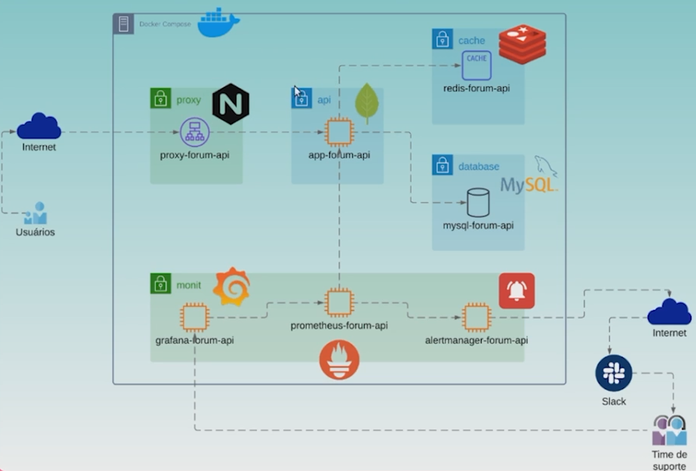

# API Observability

This project was developed as part of the **Alura Observability Course**.

## Project Overview

The main goal of this project is to demonstrate best practices in observability within API development. Below is the architecture diagram of the project:

<p align="center">
  
</p>

## Prerequisites

Before running the project, ensure you have the following installed:

- [Docker](https://www.docker.com/)
- [Docker Compose](https://docs.docker.com/compose/)

## How to Clone the Repository

To get started, clone the repository to your local machine using Git:

```bash
git clone https://github.com/lorenzouriel/prometheus-grafana-api-observability.git
cd prometheus-grafana-api-observability
```

## Running the Project with Docker Compose
Once you have Docker and Docker Compose installed, you can easily spin up the entire project using the following steps
1. Make sure you're in the project directory.
2. Run the following command to start the services:
```bash
docker-compose up
```

## Stopping the Services
To stop the services, run the following command:
```bash
docker-compose down
```